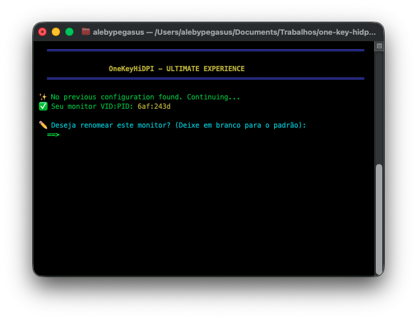
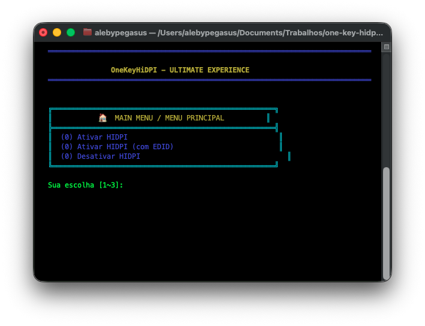
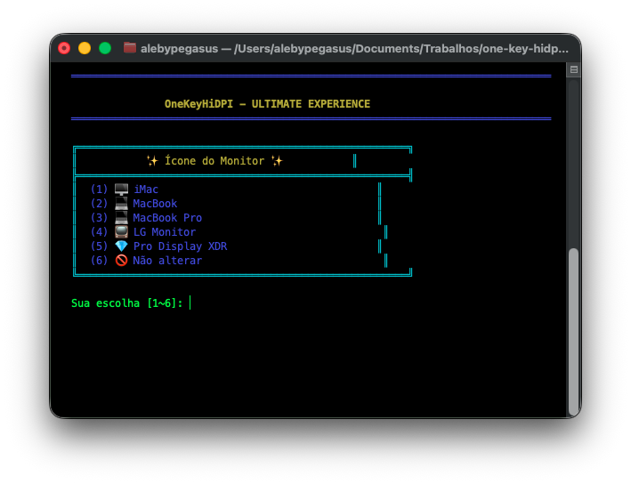
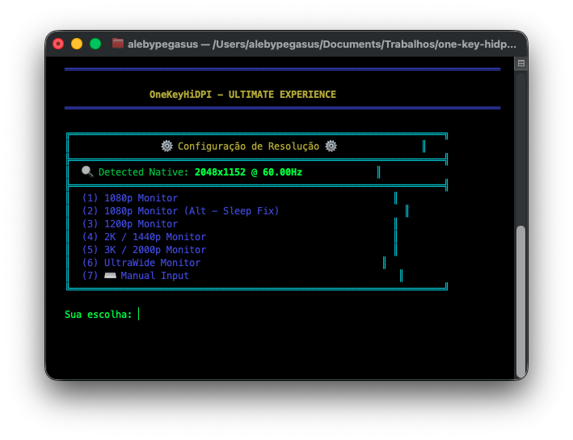
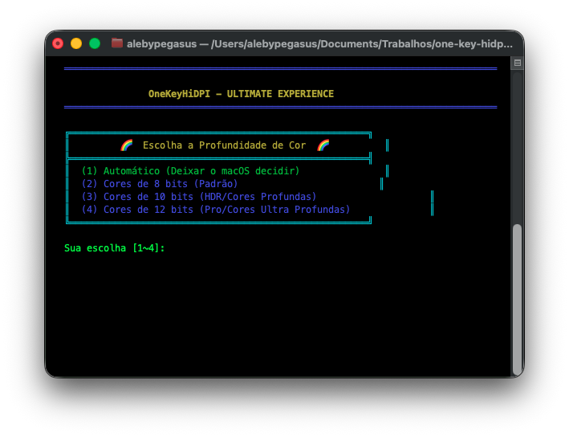
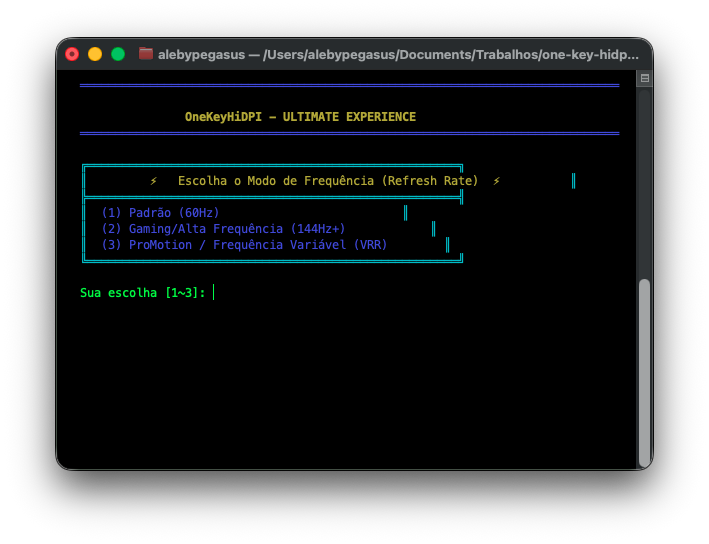
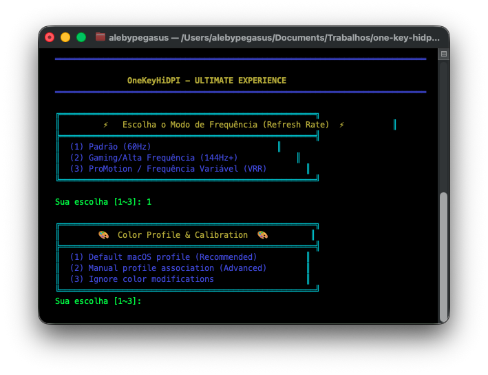
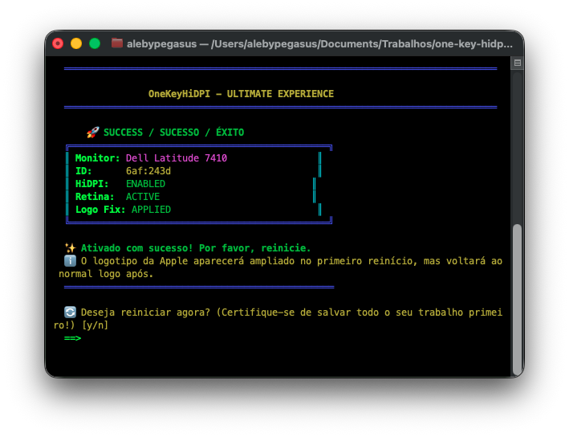

# One-Key HiDPI - Premium Edition 🚀

[English](README.md) | [Português](README-ptbr.md) | [Español](README-es.md) | [Français](README-fr.md) | [日本語](README-jp.md) | [简体中文](README-zh.md)


Ative o modo HiDPI (Retina) no seu macOS para monitores internos e externos com uma interface premium e detecção automática de hardware.

## ✨ Funcionalidades
- **Detecção Inteligente**: Detecta automaticamente a resolução nativa e a taxa de atualização (Hz).
- **Interface Premium (TUI)**: Colorida, intuitiva e moderna.
- **Multi-idioma**: Suporte para PT-BR, EN, ES, FR, JP e ZH.
- **Correção de Logo no Boot**: Resolve o problema do logo da Apple gigante.
- **Controle de Profundidade de Cor**: Suporte para 8 bits, 10 bits (HDR) e 12 bits Pro.
- **Alta Frequência e VRR**: Desbloqueie 144Hz+ e ProMotion (Taxa de Atualização Variável).
- **Ativação Forçada Retina**: Ativa a experiência nativa Apple Retina.
- **Nomenclatura Personalizada**: Escolha o nome que aparecerá nos Ajustes do Sistema.
- **Segurança**: Backups automáticos e avisos de estabilidade.


## 📦 Como Usar
1. Baixe ou clone este repositório.
2. Dê um clique duplo em `hidpi.command` ou execute no terminal:
   ```bash
   bash hidpi.sh
   ```
3. Siga as instruções coloridas na tela.

### 📸 Visão Geral do Processo
<p align="center">
  
  
  
  
  
  
  
  
</p>

4. Reinicie o sistema para aplicar as mudanças.

## 🛠 Recuperação Manual
O script cria um backup em:
`/Library/Displays/Contents/Resources/Overrides.bak`

Você pode restaurar usando:
```bash
sudo cp -r /Library/Displays/Contents/Resources/Overrides.bak /Library/Displays/Contents/Resources/Overrides
```

---
*Criado com ❤️ para a comunidade Hackintosh e macOS.*
